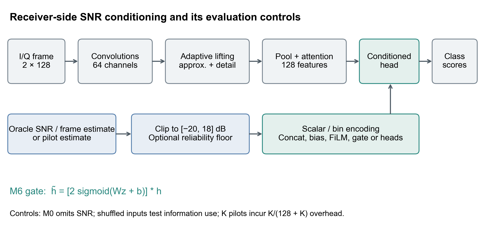

# SNR conditioning for automatic modulation classification

Code and retained data for **From Oracle SNR to Deployment: Benefits and Limits of SNR Conditioning for Automatic Modulation Classification** (Jin Huang and Qisen Gao; manuscript in preparation, not an accepted publication).

This study compares eight AWN conditioning heads, estimator reliability, training mismatch, cross-dataset boundaries, independent channels, and pilot observation costs. It does not introduce SNR conditioning itself or claim hardware validation.



## Installation

Use Python 3.12 or later. The exact environment observed during release checks is in `environment-record.json`. Select an appropriate CPU/CUDA PyTorch wheel for your platform; the recorded experiment environment used torch 2.13.0+cu130. A clean dependency installation on other platforms has not been verified.

```sh
python -m venv .venv
# Activate .venv using your shell's activation command.
python -m pip install -r requirements.txt -r requirements-torch.txt
```

## Quick start: audit reported results

No raw RadioML download or GPU is required for the summary audit.

```sh
python scripts/verify_paper_results.py
cd research/phase2-v2
python scripts/v2/run_phase12.py --smoke
```

The second command generates a tiny separate dataset and trains M0, M6, and CLDNN for two CPU epochs. It is a pipeline check, not a reproduction of the manuscript accuracies. The release was checked in a separate clean checkout with the already installed environment; it was not a clean pip installation.

## Code layout and reproduction

The historical implementation is retained at `research/phase2-v2/`. This two-level layout preserves the existing parent-relative paths to root `experiments/train_baselines.py` and `data/RML2016.04c.dat` without changing the numerical code. AWN provenance and its MIT copyright notice are preserved.

| Manuscript evidence | Implementation / configuration |
|---|---|
| M0–M7 shared-backbone comparison | `scripts/v2/run_phase3.py`, `configs/v2/phase3.yaml` |
| Estimator substitutions and class-information controls | `scripts/v2/run_phase8.py`, `configs/v2/phase8.yaml` |
| Counterexamples | `scripts/v2/run_phase5.py`, `configs/v2/phase5.yaml` |
| Deployment-matched training | `scripts/v2/run_phase9.py`, `configs/v2/phase9.yaml` |
| Reliability floors | `scripts/v2/run_phase10.py`, `configs/v2/phase10.yaml` |
| Learned TinyCNN-SNR estimator and frozen substitution | `scripts/v2/run_learned_snr.py`, `v2/lse/` |
| RML2016.04C | `scripts/v2/prepare_04c_split.py`, `scripts/v2/run_phase11.py`, `configs/v2/phase11_04c.yaml` |
| Independent channels and pilots | `scripts/v2/run_phase12.py`, `configs/v2/phase12_execution.yaml` |

Paths in the table are relative to `research/phase2-v2/`. Run the scripts from that directory. The historical full runners enforce provenance and prerequisite gates; merely downloading final arrays does not recreate the earlier phase receipts or checkpoints. See [reproduction notes](docs/REPRODUCIBILITY.md) for what is and is not replay-verified. Do not disable these gates to label new runs as the original experiments.

## Data and retained results

Download the data ZIPs from [release v0.1.0-research](https://github.com/cdhuangjin/snr-conditioning-amc/releases/tag/v0.1.0-research) and extract to the repository root. [Data instructions and licenses](data/README.md) describe contents. Raw RadioML files and complete retained independent arrays are release assets; seed-level summaries, paired effects, estimator diagnostics, and counterexamples are in `results/paper/`. The learned-estimator source, five TinyCNN-SNR checkpoints, per-frame predictions, tables, and figures are in `results/learned_snr_estimator/`. The larger AWN classifier checkpoints are not distributed in this release.

The main RML2016.10a comparison uses seeds 2022–2026 on one fixed stratified partition. Confidence intervals reflect training variability on that partition, not independent dataset uncertainty. Recorded results include negative outcomes: the RML2016.04C oracle effect is approximately +0.012 pp, whereas estimated M6 is approximately −2.863 pp below M0.

## Citation and license

There is no paper DOI yet. Cite this repository and a specific commit/release when using these artifacts; do not cite the manuscript as accepted by AEU.

Project additions use the root MIT license. The original AWN code is MIT, copyright 2023 zjwXDU; see `licenses/AWN-MIT.txt` and https://github.com/zjwfufu/AWN. Raw DeepSig/RadioML data are separately **CC BY-NC-SA 4.0**, not MIT. See `data/README.md`.
